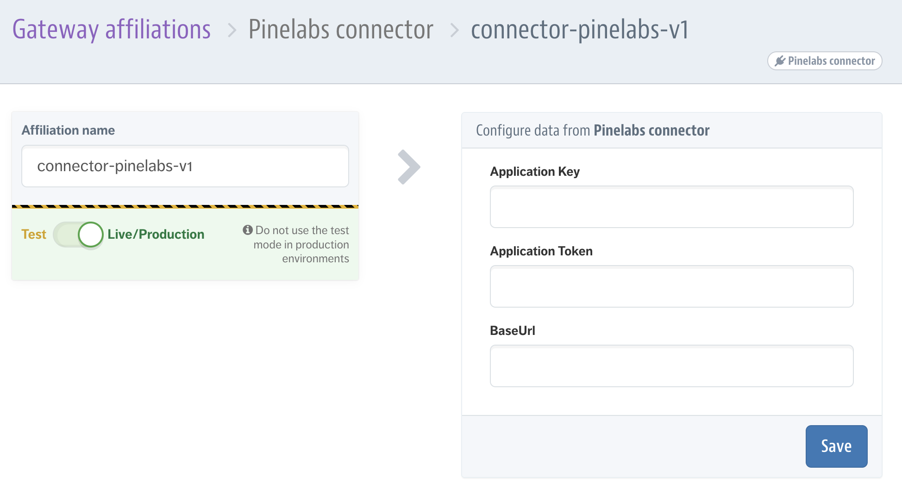
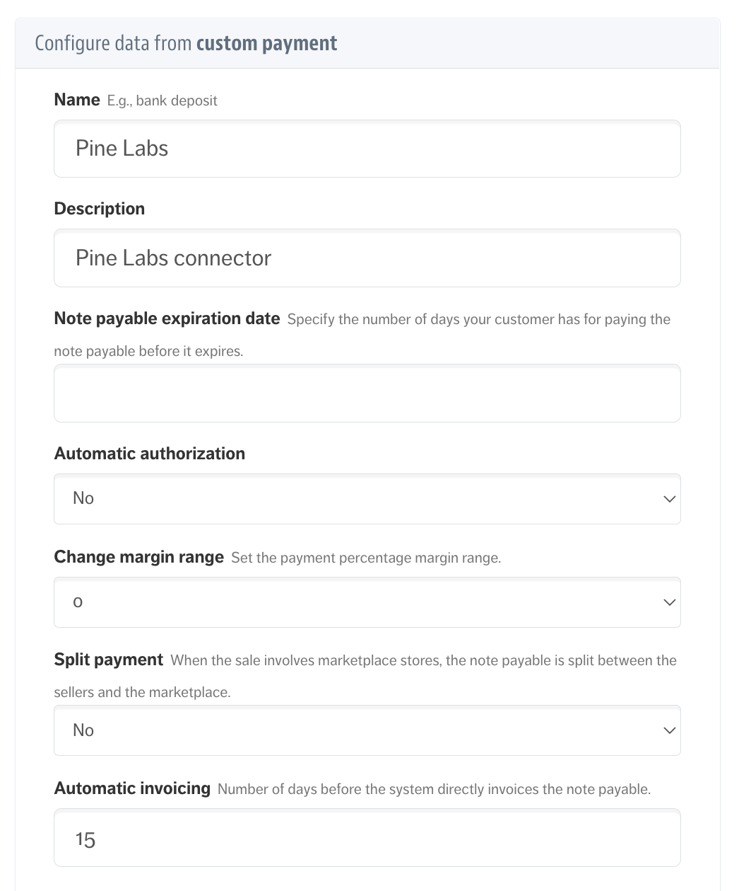
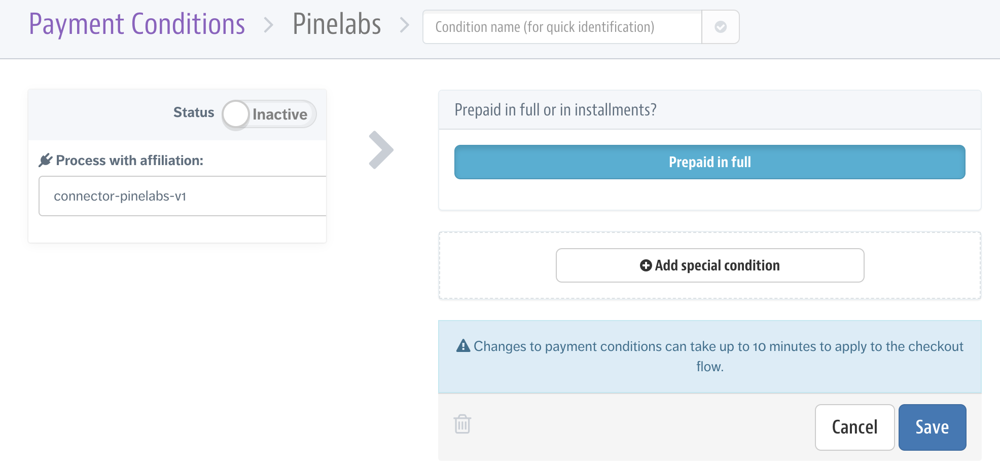
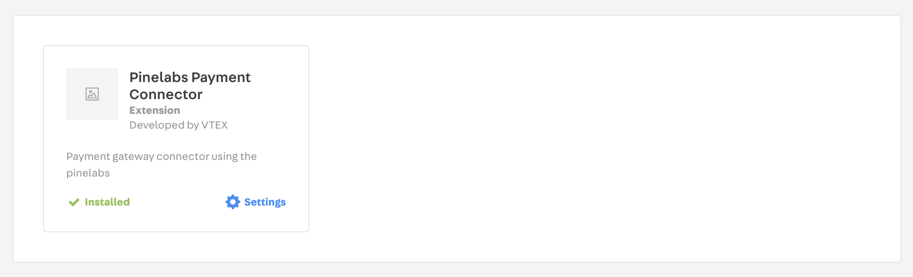
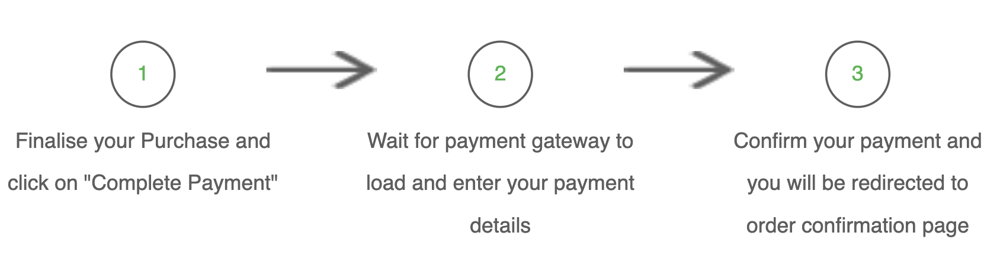
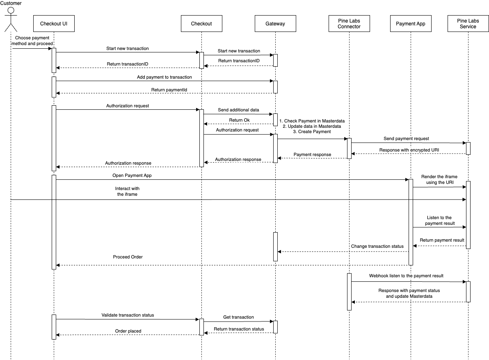

# Pine Labs Connector

The Pine Labs Connector makes use of the **[VTEX Payment Protocol Provider](https://help.vtex.com/es/tutorial/payment-provider-protocol--RdsT2spdq80MMwwOeEq0m)**

The Payment Provider Protocol is a public contract for those who want to integrate its payment providers into the VTEX platform. In other words, It is the protocol that defines how a Payment Service Provider must integrate with the VTEX SmartCheckout system.

This resource enables us to increase the range of payment methods and partner options that we can offer to our merchants. This way, they have more options to create a strategy aligned with their market needs. It is important to mention that integration is only possible if the store or the partner fulfills some criteria.

Our protocol is composed of nine endpoints, all public and documented in the Developer Portal. To check more details about each one of them, go to the **[Payment Provider Protocol API overview page](https://developers.vtex.com/docs/guides/payment-provider-protocol-api-overview)**. More information about the integration steps can be found in the **[correspondent Help Center article](https://help.vtex.com/en/tutorial/payment-provider-protocol--RdsT2spdq80MMwwOeEq0m)**.

<p>&nbsp;</p>
<p>&nbsp;</p>

# Install and configuration Guide

1. Install `vtexasia.connector-pinelabs` in your account.

   ```powershell
   vtex install vtexasia.connector-pinelabs@1.x
   ```

2. Then go to admin account in module `Transactions/Payments/Settings`, in tab `Gateway affiliations` search Pinelabs and click in Pinelabs connector.

   

3. Fields:

   - Fill in the `Application Key` field with the key assigned for the Pine Labs account.
   - Fill in the `Application Token` field with the token assigned for the Pine Labs account.

4. After configuring the Gateway Affiliation, go to the Custom payments

   
   
   and create a new payment under Notes payables.

   
   
   <p>&nbsp;</p>

   After saving the information, you will be redirected to configure the Payment conditions.
   
   <p>&nbsp;</p>

   
   
   <p>&nbsp;</p>

   Select Pine Labs connector and wait around 10 mins for the connector to appear on your checkout page.

5. Then go to admin account in module `Account Settings/Apps/My apps`, search for `Pinelabs Payment Connector` search Pinelabs and click in Pinelabs connector.

   
   
   <p>&nbsp;</p>

   - Fill in the `Application Key` and `Application Token` fields with the keys assigned for the VTEX account.
   - Fill in the `Merchant Id`, `Access code` and `Secret code` fields with the Pinelabs credentials.
   - Fill in the `Base Url`, `Plural Script Url` fields with pluralonline.
    - For production `Base Url` - `https://api.pluralonline.com` and `Plural Script Url` - `https://checkout.pluralonline.com/v1/web-sdk-checkout.js`
    - For Development / Staging `Base Url` - `https://api-staging.pluralonline.com` and `Plural Script Url` - `https://checkout-staging.pluralonline.com/v1/web-sdk-checkout.js`

<p>&nbsp;</p>
<p>&nbsp;</p>

# Functional Guide

To use the Pine Labs payment method, at checkout select Pinelabs as your payment method, this will redirect you to Pine Labs service to complete the payment process.



<p>&nbsp;</p>
<p>&nbsp;</p>

# Middleware Guide

<p>&nbsp;</p>

## Workflow

The Payment App model applies to a large variety of payment methods thanks to its interaction with the Checkout API, as shown in the following sequence diagram:

<p>&nbsp;</p>



<p>&nbsp;</p>

Below is described the flow in the same order of the sequence diagram:

1. Checkout UI sends a Start Transaction request to the Checkout API.

2. Checkout API sends a **[Start Transaction request](https://developers.vtex.com/vtex-rest-api/reference/1createanewtransaction)** to the Gateway API.

   - VTEX Payment Gateway creates the new transaction and generates a unique `transactionId`, which is returned to the Checkout, and then to the Checkout UI.

3. Checkout UI sends a **[Send Payments request](https://developers.vtex.com/vtex-rest-api/reference/2sendpaymentspublic)** directly to the Gateway API.

   - The Gateway will create, for each payment, a payment entity inside the transaction entity that was created in the previous request. Note that, for multiple payments, they are all sent in this same request. That is, one transaction can have multiple payments. For each payment entity, a `paymentId` is generated and all of them are returned to the Checkout UI. This step sends the actual payment information (i.e.: credit card data).

4. Checkout UI sends an Authorization request to the Checkout API.

5. Checkout API encapsulates two requests to the Gateway API.

   - The first is the **[Send Additional Data request](https://developers.vtex.com/vtex-rest-api/reference/3sendadditionaldata)** that sends to the Gateway API information about the order, such as the client profile data, the shipping address, and the cart information (cart items). Such information is securely stored in the Gateway database, and this information is used by anti-fraud providers, and also used by a few payment providers to Authorize the transaction.
   - The second is the actual **[Authorization request](https://developers.vtex.com/vtex-rest-api/reference/4doauthorization)** that the Checkout API performs to the Gateway API. This request will trigger the Payment Authorization workflow inside the Gateway API.
     a. The Gateway API calls the **[Create Payment request](https://developers.vtex.com/vtex-rest-api/reference/createpayment)** for the correct connector depending on the Payment Conditions that was set up by the store administrator.
     b. At this point, the Pine Labs connector will first check and update the Masterdata about the payment details, then it handles the request and performs its logic depending on the Payment method. Using iframe as an example, the Pine Labs connector will request the Pine Labs Service to create a payment in their API and will receive the necessary information to build the iframe.
     c. The Pine Labs connector responds to the Create Payment request to the Gateway. The body of the response has a `paymentAppData` field, which contains two properties.
     ```ts
         paymentAppData: {
            appName: 'vtexasia.connector-pinelabs',
            payload: JSON.stringify(pinelabsOrderData),
         }
     ```
     The first is `appName` for the name of the Payment App that will be used in the transaction. The second is `payload` containing the payload to complete the transaction (i.e.: the information to build the iframe). Then, the Gateway responds to the Checkout API and it responds back to the Checkout UI which instantiates the Payment App with the corresponding payload that was generated in the connector.

6. The Checkout UI instantiates the Payment App defined by the `paymentAppData.appName` and adds to the app object the `appPayload` property and fills this property with the content of `paymentAppData.payload`. Then the Payment App can perform its logic here (simulate a redirection inside the Payment App frame). At this point, the transaction is in Authorizing state (more information about transaction status can be found in the **[Transaction flow](https://help.vtex.com/en/tutorial/transaction-flow-in-payments--Er2oWmqPIWWyeIy4IoEoQ)** in Payments article). In the Pine Labs connector, there is a webhook that constantly listens to the payment response from the Pine Labs Service, so that it can use this information to update the Masterdata.

7. When the user finishes the interaction, the Payment App closes and it will trigger the transaction Validation in the Checkout UI, which starts the validation where the Checkout UI gets the transaction status from the Checkout API (which will **[request the transaction status](https://developers.vtex.com/vtex-rest-api/reference/transactiondetails)** from the Gateway API). If the transaction status is Authorized or Undefined then the Checkout UI displays the Order Placed screen. Else, the Checkout UI shows a warning and returns to the state where the user can choose the payment method.

<p>&nbsp;</p>

## Connector functions

There are three main functions implemented in Pine Labs connector.

- **Authorize**
  At this point VTEX calls the `/payments` endpoint and sends a payload with the payment data to your provider. The provider must process this data and send back the response, which must contain one of the status values: approved, denied, or undefined.
  The undefined status represents the state where the provider could not finish processing the payment. This may be due to a long processing time or some asynchronous processing.
- **Refund/Cancellation**
  After the first call for payment authorization, the store may cancel the order at any time. At the time of cancellation, the following situations may occur:
  - Payment transaction has already been settled: the cancellation request will then result in a refund call to the provider endpoint `/payments/{id}/refunds`, where `{id}` stands for the payment ID in VTEX.
  - Payment transaction has not yet been settled: we will call the provider’s endpoint `/payments/{id}/cancellations`, where `{id}` is the payment ID in VTEX. If there is any difficulty in processing the automatic cancellation, an email will be sent to the merchant so that he can manually cancel it.

<p>&nbsp;</p>

## PaymentProvider

This is an abstract class with the signatures of the routes functions required in Pine Labs connector, according to the protocol.
We create a new class extending the `PaymentProvider`, which must implement a function for each route. The functions will receive the request body (when there is one) as a parameter and the response must be returned as an object, such as the example shown below:

```ts
export default class PineLabs extends PaymentProvider {
  // ... implementation of the other routes functions

  // for payment authorization
  public async authorize(authorization: AuthorizationRequest): Promise<AuthorizationResponse> {}

  // for payment cancellation
  public async cancel(cancellation: CancellationRequest): Promise<CancellationResponse> {}

  // for payment refund
  public async refund(refund: RefundRequest): Promise<RefundResponse> {}
}
```

<p>&nbsp;</p>

## Payment Provider Service

This class adds functionality to the Service in `@vtex/api`. It must be called and the Pine Labs connector must be passed as a property of the first parameter. It will then automatically create the necessary routes for you.

```ts
import { PaymentProviderService } from '@vtex/payment-provider';

new PaymentProviderService({
  connector: PineLabs,
});
```

By default, the Payment Provider Service declares the following routes:

- `/payment-methods`
- `/manifest`
- `/payments`
- `/settlements`
- `/refunds`
- `/cancellations`
- `/inbounds`

Any additional routes needed by the service must be declared separately and used as parameters:

```ts
export default new PaymentProviderService({
  connector: PineLabs,
  routes: {
    paymentStatus: method({
      POST: [updatePaymentStatus],
    }),
    paymentWebhook: method({
      POST: [paymentWebhook],
    }),
  },
});
```
